## PictroLib
PictroLib is a classic crossplatform image processing library developed to be integrated as a backend for an image editing application 
that I plan to make. It can perform the basic operations on both Black-White and coloured images and can also be extended to add more functionalitites depending on the need of the application.

Currently it supports only .BMP files and has the appropriate mechanisms to read, parse and manipulate the image data. Some features include - 

### Rotation/Mirror
The current implementation support the followings directions.

```
LEFT
RIGHT
UPSIDEDOWN
MIRROR
```
<table width = "100%">
<td></td>
<td align = "center">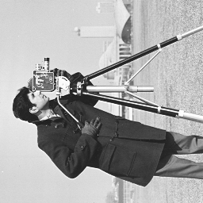</td>
<td align = "right">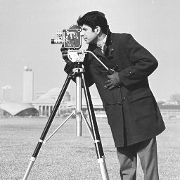</td>
</table>

### Brightness
The current implementation support the followings options

```
increaseBrightess(factor)
decreaseBrightness(factor)
```
<table width = "100%">
<td>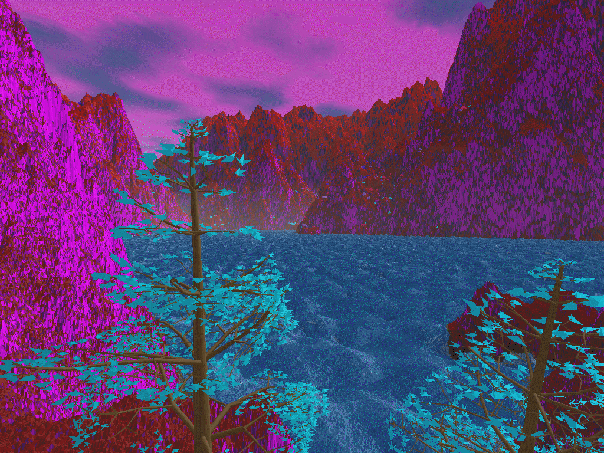</td>
<td align = "center">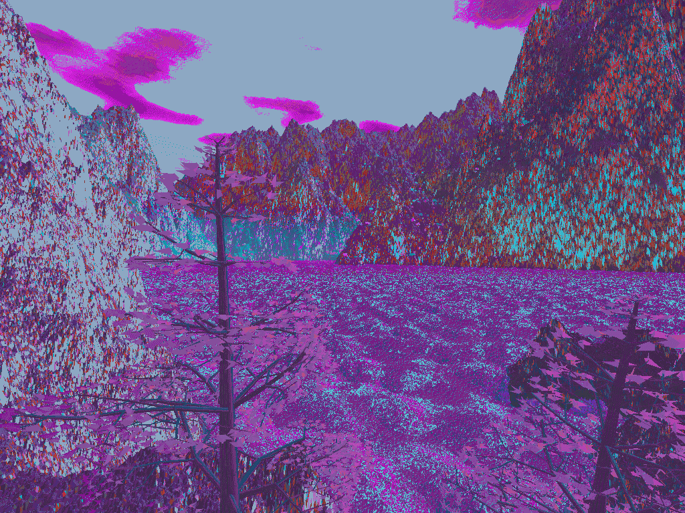</td>
<td align = "right">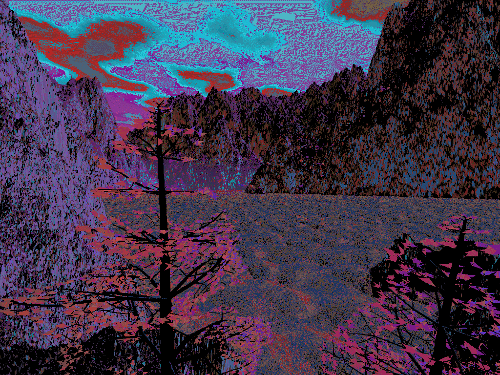</td>
</table>

### Contrast
The contrast is created by equalizing the image histogram.

```
Add Images here
```
<table width = "100%">
<td>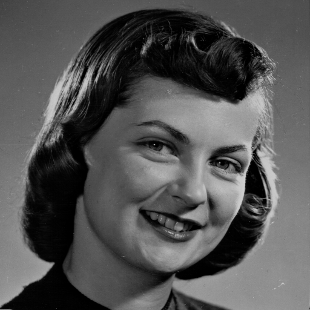</td>
<td align = "center">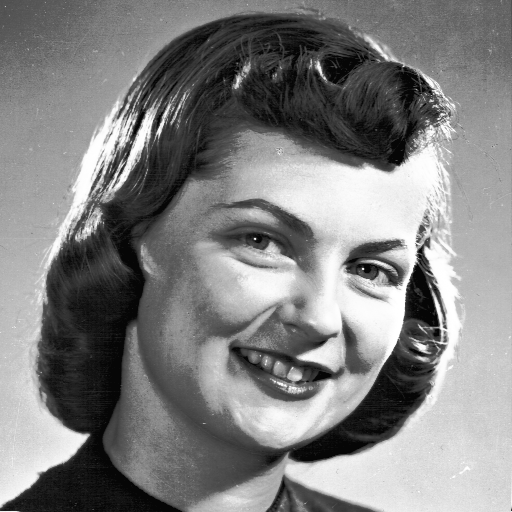</td>
</table>

### Negetive
The blur is calculated by simply inverting the pixel values at each pixel.
<table width = "100%">
<td></td>
<td align = "center">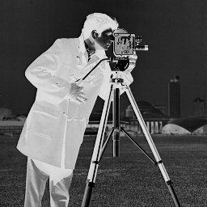</td>
</table>

### Blur
The blur is calculated by convolution of the image with the KERNAL_FILTER

```cpp
static const float KERNAL_FILTER[3][3] =  {
    {1.0/9.0, 1.0/9.0, 1.0/9.0},
    {1.0/9.0, 1.0/9.0, 1.0/9.0},
    {1.0/9.0, 1.0/9.0, 1.0/9.0}
};
```
<table width = "100%">
<td></td>
<td align = "center">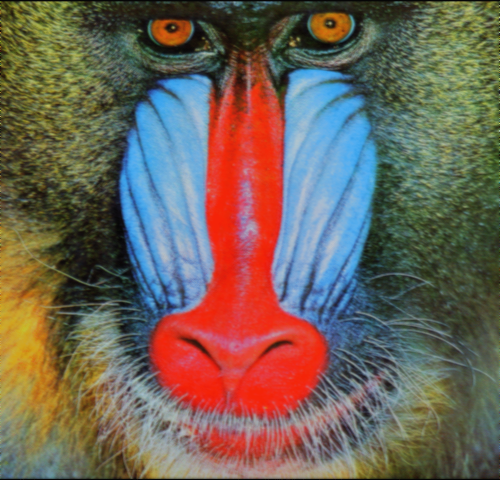</td>
</table>


### Sepia
The values for sepia filter is taken from the internet and in the same way we can add many other classic filters

```cpp
r = (m_imageData[i][0] * 0.393) + (m_imageData[i][1] * 0.769) + (m_imageData[i][2] * 0.189);
g = (m_imageData[i][0] * 0.349) + (m_imageData[i][1] * 0.686) + (m_imageData[i][2] * 0.168);
b = (m_imageData[i][0] * 0.272) + (m_imageData[i][1] * 0.534) + (m_imageData[i][2] * 0.131);
```
<table width = "100%">
<td></td>
<td align = "center">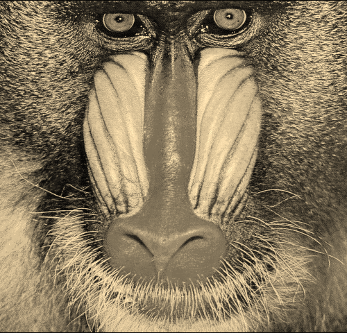</td>
</table>

### Maximum
The maximum filter assigns each pixel with a value which is the maximum in a given viscinity. For 3, 5, 9 for 
1, 2, 3 level deep neighbours.

```cpp
applyMaxFliter(depth)
```
<table width = "100%">
<td>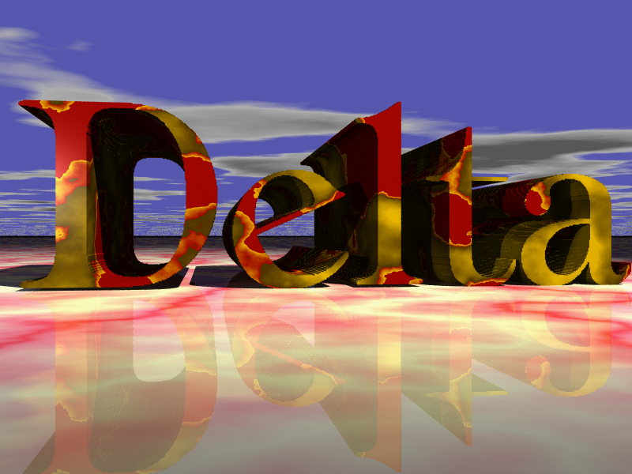</td>
<td align = "center">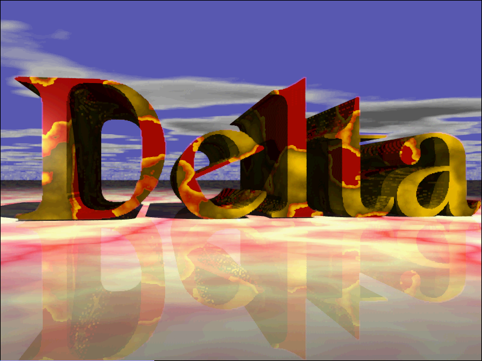</td>
<td>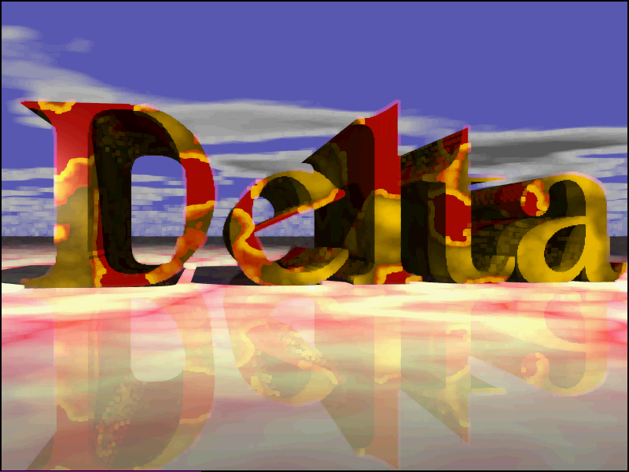</td>
<td align = "right">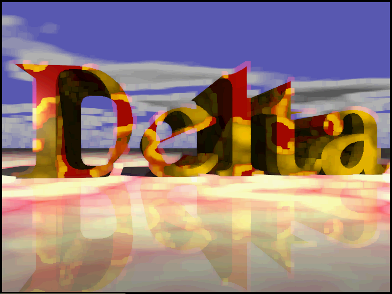</td>
</table>

### Minimum
The minimum filter assigns each pixel with a value which is the maximum in a given viscinity. For 3, 5, 9 for 
1, 2, 3 level deep neighbours.

```cpp
applyMinFilter(depth)
```
<table width = "100%">
<td></td>
<td align = "center">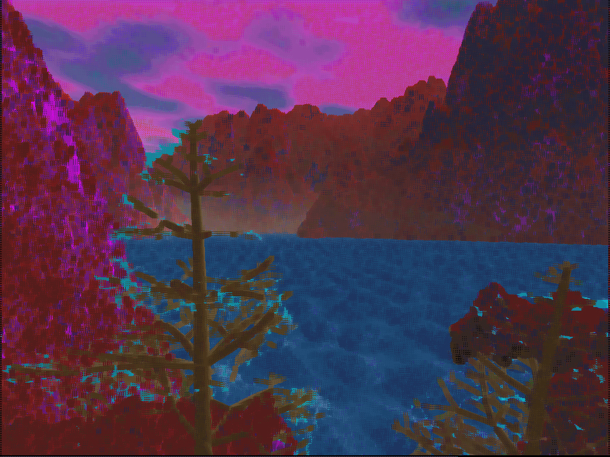</td>
<td>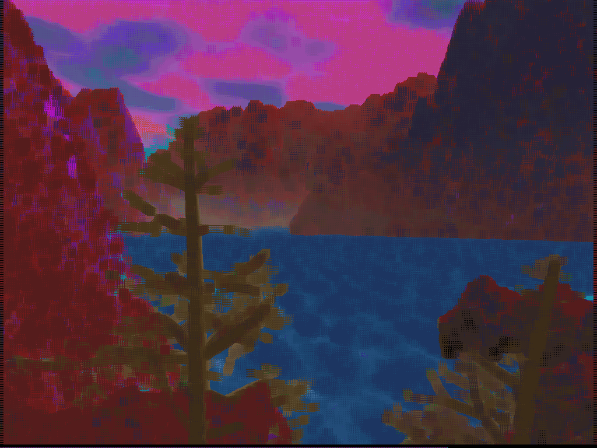</td>
<td align = "right">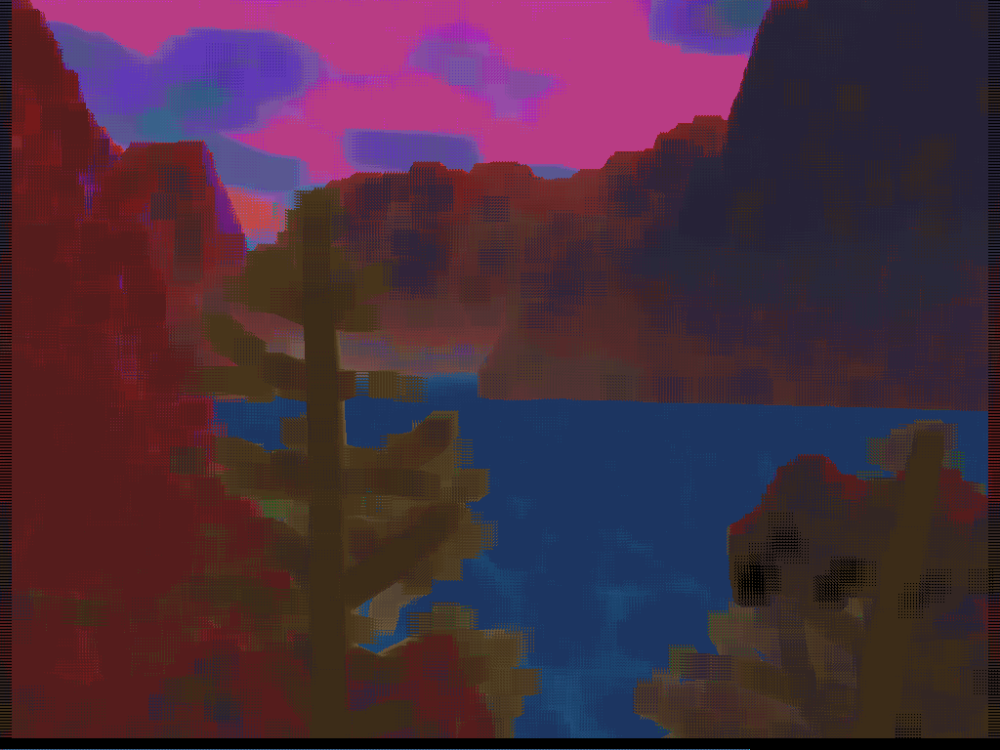</td>
</table>

### Median
The median filter assigns each pixel with a value which is the median in a given viscinity. For 3, 5, 9 for 
1, 2, 3 level deep neighbours.

```cpp
applyMedian(depth)
```
<table width = "100%">
<td></td>
<td align = "center">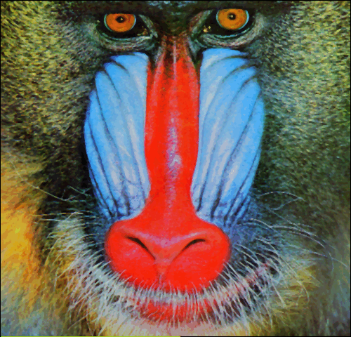</td>
<td></td>
<td align = "right"></td>
</table>

### Convolution Masks/Edge Detection
We use a variety of populare edge dectedtion masks which after convolution with the image data give us some solid edges
in any desired direction.

```cpp
LINE_DETECTOR_HOR_MASK,
LINE_DETECTOR_VER_MASK,
LINE_DETECTOR_LDIA_MASK,
LINE_DETECTOR_RDIA_MASK,

//Prewitt Masks
PREWITT_HOR,
PREWITT_VER,

//Sobel Masks
SOBEL_HOR,
SOBEL_VER,

//Robinson Masks(Compass Operator)
ROBINSON_NORTH,
ROBINSON_NORTHEAST,
ROBINSON_EAST,
ROBINSON_SOUTHEAST,
ROBINSON_SOUTH,
ROBINSON_SOUTHWEST,
ROBINSON_WEST,
ROBINSON_NORTHWEST,

//Kirsch Masks(Compass Operator)
KIRSCH_NORTH,
KIRSCH_NORTHEAST,
KIRSCH_EAST,
KIRSCH_SOUTHEAST,
KIRSCH_SOUTH,
KIRSCH_SOUTHWEST,
KIRSCH_WEST,
KIRSCH_NORTHWEST,

//Laplacian Masks
LAPLACIAN_NEGETIVE,
LAPLACIAN_POSITIVE,

//High Pass FIlter(Sharpner)
IMAGE_SHARPNER
```
<table width = "100%">
<td>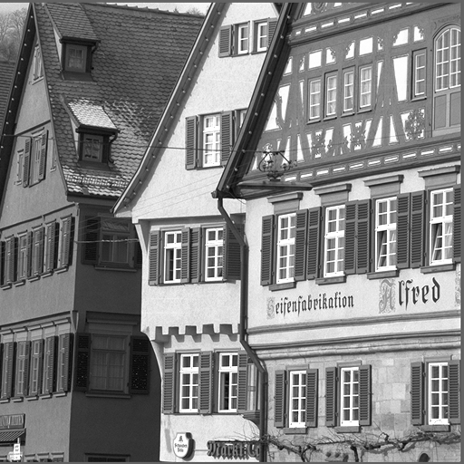</td>
<td align = "center">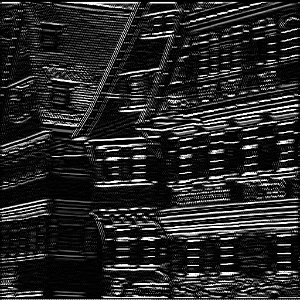</td>
<td align = "right">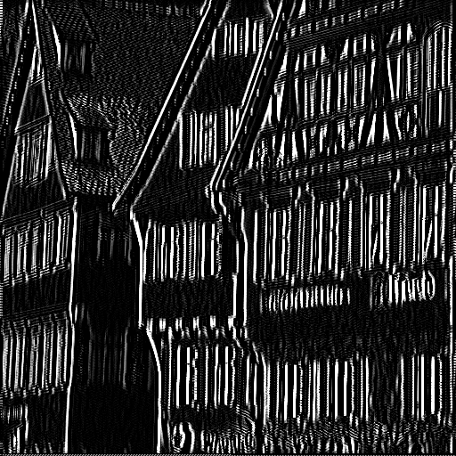</td>
</table>

### Gaussian Noise
Produce Gaussian noise for a given image 

<table width = "100%">
<td></td>
<td align = "center">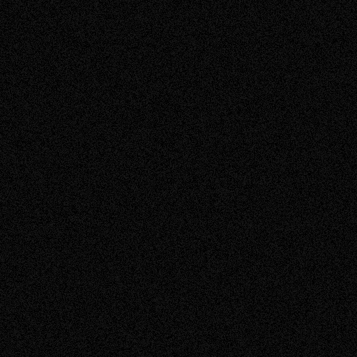</td>
</table>

### Salt and Pepper Noise
Produce grainy noice with a given intensity. For example in this case we generate two grainy 
noises on a sample image with .1 and .3 intensity.
```
generateNoise(intensity)

```

<table width = "100%">
<td></td>
<td align = "center">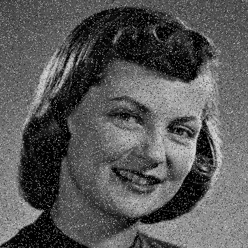</td>
<td align = "right">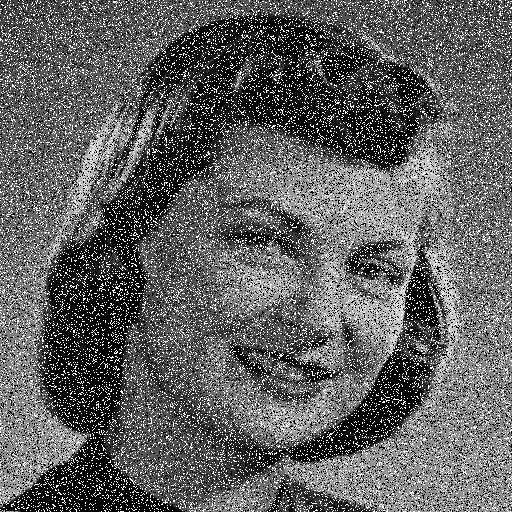</td>
</table>


That is it for the Library, there are a few more operations for which I have not attached the photos but you can play with the 
convolution masks and even add some of your own in the Constants file and attach the results here. :)


